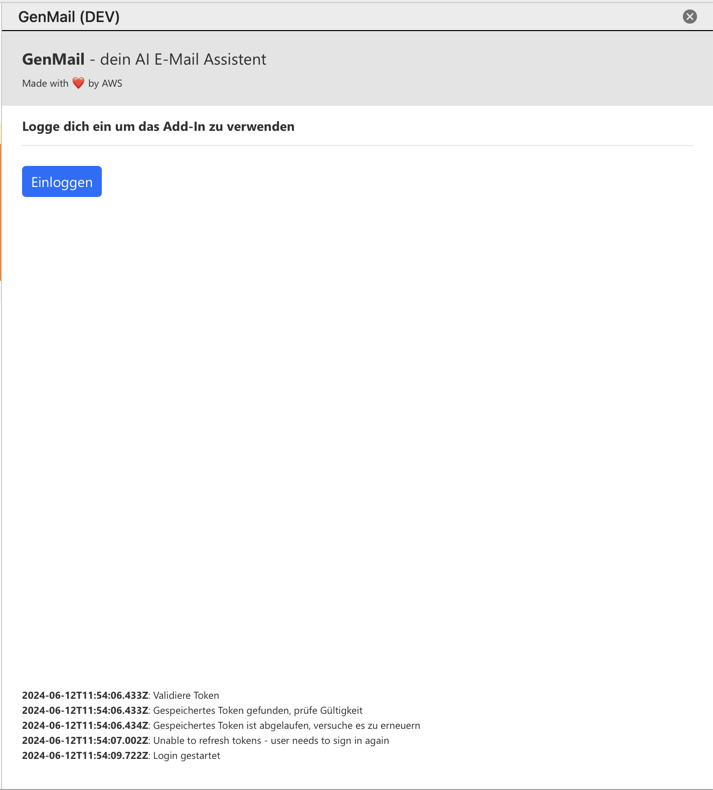
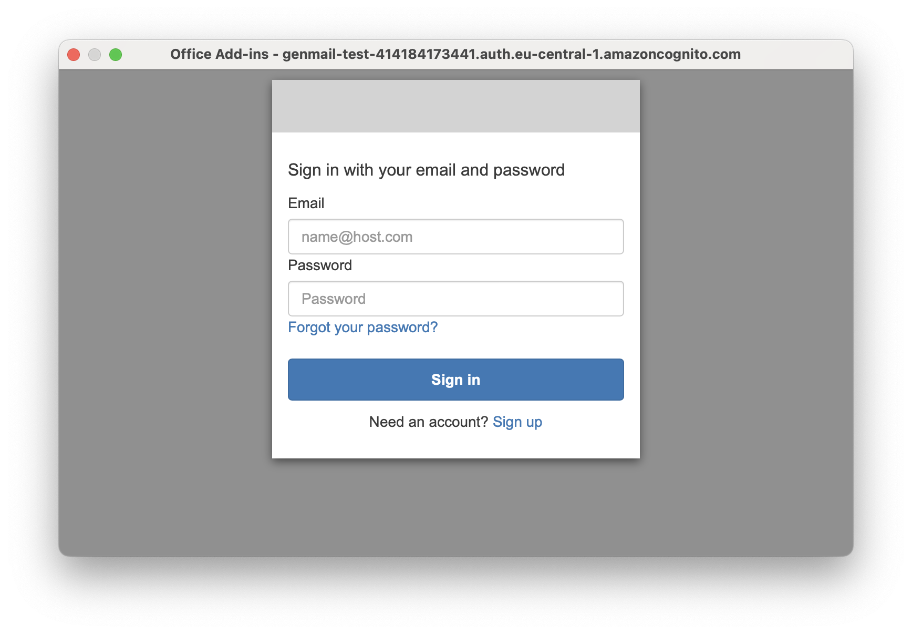
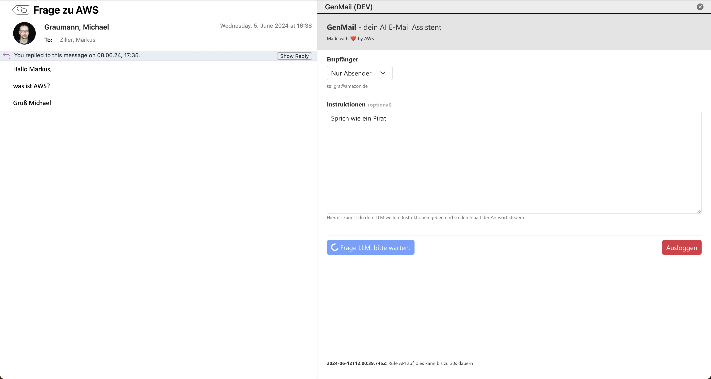
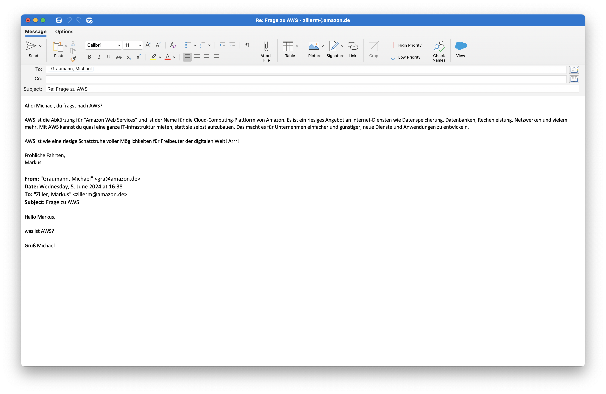

# GenMail

This is a sample project accompanying the article series _Keine Zeit zum E-Mail schreiben? Wie man sich seinen eigenen GenAI-E-Mail-Assistenten auf AWS baut_ in the German Java-focused tech journal Java Magazin.

Over the course of two articles, the authors Michael Graumann and Markus Ziller provide an in-depth discussion of the email assistant's architecture.

The articles were published in the 08/24 and 09/24 issues of Java Magazin.

## Getting Started

### Prerequisites

- node.js v16+
- npm installed
- Java 17+
- An AWS Account
- Enable Claude 3 Sonnet in your AWS Account as described [here](https://docs.aws.amazon.com/bedrock/latest/userguide/model-access.html)

### Deploy backend

#### Preparation

- Install the CDK by following [these instructions](https://docs.aws.amazon.com/cdk/v2/guide/getting_started.html)
- Inspect `cdk/src/main/java/com/amazon/aws/samples/genmail/GenMailApp.java`. 
  - Change `ACCOUNT_ID` to the id of your AWS account.
  - Per default, we define two environments (`DEV` and `PROD`) of the backend application in different regions of the same AWS Account. You can change this to any combination of Account and Region, as long as Claude 3 Sonnet is already available in that region.
  - You can also add additional environments
- Run `cdk bootstrap aws://<ACCOUNT_ID>/<REGION>` for every combination of region and account id, you want to use
- Make sure that you have valid credentials that the CDK can use for [programmatic access](https://docs.aws.amazon.com/cdk/v2/guide/getting_started.html#getting_started_auth) to your account

#### Deploy and validate the dev environment

1. Deploy the dev environment by running `source ./deploy.sh dev`. This should take around 1-2 minutes
2. After the stack deployment succeeded, CDK generated an output file containing all relevant parameters in `cdk/outputs/env_dev.json`
3. Run the following curl command

```
API_URL=<ApiEndpoint value copied from CDK output>
curl --request POST \
  --url $API_URL/noauth \
  --header 'Content-Type: application/json' \
  --header 'User-Agent: insomnia/2023.5.8' \
  --data '{
    "mail": "Hallo Markus, Was ist AWS? Gruß Michael",
    "instructions": "Fasse dich kurz und nutze nicht mehr als 2 Sätze. Verwende kein HTML."
}'
```

4. After 5-10s, you should retrieve a response, e.g.

```
{
	"response": "AWS steht für Amazon Web Services und ist eine Cloud-Plattform, die eine breite Palette an Cloud-Computing-Diensten wie Speicher, Datenbanken, Analytik und mehr anbietet. Es ist einer der führenden Cloud-Anbieter."
}
```

5. You can optionally remove the unauthenticated route `/response/noauth` by uncommenting the following code snippet and redeploying the CDK stack
```
if (isTest) {
    response
        .addResource("noauth")
        .addMethod("POST", new LambdaIntegration(handlerFn));
}
```

6. Your dev backend is ready. Continue with setting up the frontend or deploying the prod environment

#### Deploy prod environment

1. Deploy the prod environment by running `source ./deploy.sh prod`. 
   - The prod environment does not have an unauthenticated route.
   - The prod deployment will take around 5-10min.
2. After the stack deployment succeeded, the CDK generated an output file containing all relevant parameters in `cdk/outputs/env_prod.json`
3. Your prod backend is ready. Continue with setting up the frontend.

#### Note: Use of own domains

- API Gateway, Cognito and CloudFront support using your own domain names instead of the default AWS-provided domains.
- Refer to the AWS documentation for detailed steps on how to add custom domains to API Gateway and CloudFront distributions:
  - [Adding a Custom Domain to an API Gateway REST APIs](https://docs.aws.amazon.com/apigateway/latest/developerguide/how-to-custom-domains.html)
  - [Using Custom Domain Names with CloudFront](https://docs.aws.amazon.com/AmazonCloudFront/latest/DeveloperGuide/CNAMEs.html)
  - [Setting Up a Custom Domain for Amazon Cognito User Pools](https://docs.aws.amazon.com/cognito/latest/developerguide/cognito-user-pools-add-custom-domain.html)

    
## Install Outlook Add-In

### Prerequisites

- Install node.js
- Get the `CognitoSignInUrl` from `cdk/outputs/env_dev.json`, open it in a browser and create a user in Cognito.
- Run `npm install` in the `frontend` folder

### Local development

To use the plugin in a dev environment, follow these steps:

1. Edit `.env_dev` and set values to respective values from the CDK outputs in `cdk/outputs/env_dev.json`

```
FRONTEND_URL=https://localhost:3000
API_URL=<ApiEndpoint from CDK Output>
COGNITO_ENDPOINT=<CognitoBaseUrl from CDK Output>
COGNITO_CLIENT_ID=<CognitoClientId from CDK Output>
```

2. For the authentication flow, the add-in needs to open a pop-up that loads the Cognito Hosted UI. Add `COGNITO_ENDPOINT`  to `<AppDomains></AppDomains>` of `manifest.dev.xml` to allow this.

```
<AppDomains>
    <AppDomain>https://genmail-test-xxxxxxxxxxx.auth.eu-central-1.amazoncognito.com</AppDomain>
</AppDomains>
```

3. Navigate to `frontend` and run `npm run dev-server`. This will start a local development server at `https://localhost:3000`. Keep the local development server running. Changes to the files will be hotswapped
4. Go to Outlook and install the plugin from file (`manifest.dev.xml`) as described [here](https://learn.microsoft.com/en-us/office/dev/add-ins/outlook/sideload-outlook-add-ins-for-testing?tabs=windows-web)

### Production use

1. Edit `.env_prod` and set values to respective values from the CDK outputs in `cdk/outputs/env_prod.json`

```
FRONTEND_URL=<Taken from CDK Output>
API_URL=<Taken from CDK Output>
COGNITO_ENDPOINT=<Taken from CDK Output>
COGNITO_CLIENT_ID=<Taken from CDK Output>
```
2. For the authentication flow, the add-in needs to open a pop-up that loads the Cognito Hosted UI. Add `COGNITO_ENDPOINT`  to `<AppDomains></AppDomains>` of `manifest.xml` to allow this.

```
<AppDomains>
    <AppDomain>https://genmail-xxxxxxxxxxx.auth.eu-central-1.amazoncognito.com</AppDomain>
</AppDomains>
```
3. Replace all occurrences of FRONTEND_URL in manifest.xml with the respective value from `.env_prod`, e.g `<HighResolutionIconUrl DefaultValue="FRONTEND_URL/assets/logo.png"/>` becomes `<HighResolutionIconUrl DefaultValue="FRONTEND_URL/assets/logo.png"/>`
4. Run `npm run build:prod` to build the plugin for production
5. Upload the generated resources in dist to the S3 Bucket (`bucketName` in CDK Output) created by the CDK, e.g. by running `aws s3 sync ./dist s3://<ACCOUNT_ID>.<REGION>.genmail.web-dist`
6. Go to Outlook and install the plugin from the CDN (`https://xxxxxxxx.cloudfront.net/manifest.xml`) as described [here](https://learn.microsoft.com/en-us/office/dev/add-ins/outlook/sideload-outlook-add-ins-for-testing?tabs=windows-web)

### Usage

- Select an email in Outlook
- Open the plugin via the menu bar



- Login
    - If you log in for the first time, you need to create a user. You can do this directly in the pop-up or beforehands by going to `CognitoSignInUrl` in the CDK Output
    - If you create a user in the pop-up you will not be logged in right away but have to trigger the login flow (excl. the user creation) a second time for it to work



- (Optional) Provide further instructions for the LLM, e.g. "Sprich wie ein Pirat" / "Talk like a pirat"



- After a few seconds a new draft that contains the LLM generated mail will pop up.

